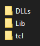

# G++ and Makefile

In the directory of our execution file put a `pythonX.dll` and `pythonXY.dll`. Then make a folder `Python`.

Inside that folder put this folders. (We need tlc folder only if we want to use tkinter liblary)



Then I added MyScripts folder were I put my Python code.

You need to also copy include and libs folders to one. I usualy put it one folder above the sln file.

### The Makefile

I made a very simple Makefile:

```
CFLAGS = -Wall -O2 -march=native -std=c++17 -I../Python/include
LDFLAGS = -L../Python/lib/

main:
	g++ $(CFLAGS) -o ./build/PythonAndCppTutorial main.cpp $(LDFLAGS) -lpython310
```

To compile just run `make` command in your terminal.
Remember you must me in the directory where you Makefile is.

Now we can paste code from the official documentation of Python/api.

```
#define PY_SSIZE_T_CLEAN
#include <Python.h>

int main(int argc, char *argv[])
{
    wchar_t *program = Py_DecodeLocale(argv[0], NULL);
    if (program == NULL) {
        fprintf(stderr, "Fatal error: cannot decode argv[0]\n");
        exit(1);
    }
    Py_SetProgramName(program);
    Py_Initialize();
    PyRun_SimpleString("from time import time,ctime\n"
                       "print('Today is', ctime(time()))\n");
    if (Py_FinalizeEx() < 0) {
        exit(120);
    }
    PyMem_RawFree(program);
    return 0;
}
```

# Let's test this

In MyScripts folder I added two files:
* main.py 
* setgui.py

main.py:
```
import tkinter as tk
import MyScripts.setgui as setg

def main():
    menu = tk.Tk()    

    menu.geometry("400x400+300+300")
    menu.resizable(False,False)
    menu.title("It works")
    menu.config(bg="#111111",bd=0)

    setg.setmenu(menu)

    menu.mainloop()

main()
```

As you can see. When I want to import my module `setgui` I need to add name of my folder but I don't have to do this for default modules.

To main.cpp add:

```
PyRun_SimpleString("exec(open('Python/MyScripts/main.py').read())");
```