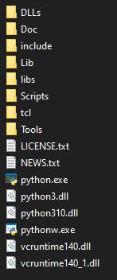

# Tutorial For Embedding Python In C++

In this tutorial I will demonstrate how you can embedd Python interpreter to any C++ program on the high level. 

The following documentation will show you full process.
This tutorial is mainly for Windows users.

Before going futher we need to specify what higl level embedding actualy mean.

It's the simplest form of embedding Python. It allowes ous to execut Python scripts without needing to interact with the application directly.

However with this method isn't recommended to exchanging data values between Python and C++.

I will show you how to make this using:
* Visual Studio 2019
* G++ and Makefile

In both examples you need to install python interpreter on your computer.

After that find the directory where you intalled Python.
If you did't customize your intall directory you can find it in:
```
    C:\Users\User_Name\AppData\Local\Programs\Python\PythonXY
```

In this place we should find all important files:



When we have this we can move to two diffrent ways.

Embedding with:
* [Visual Studio](./Visual-Studio/README.md)
* [G++ and Makefile](./Gpp-and-Makefile/README.md)

Official Python Embedding documentation:
* [Embedding](https://docs.python.org/3/extending/embedding.html)